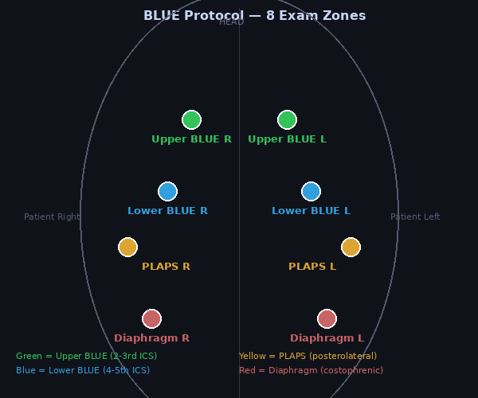
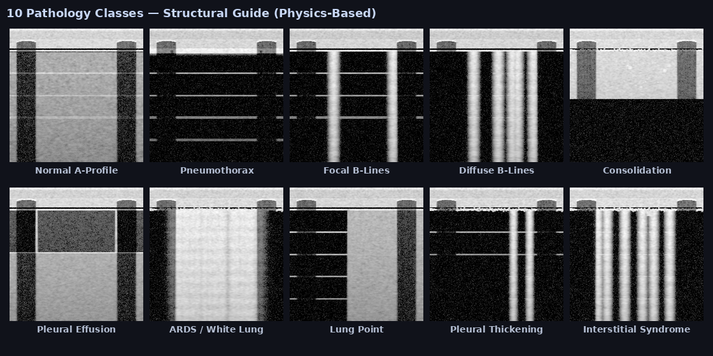

# MoCoLUS System Architecture

> Last updated: 2026-04-07 — reflects ControlNet DDPM integration, anatomy bank, frame cache pipeline.

## Table of Contents

0. [Clinical Reference (for Physicians)](#0-clinical-reference)
1. [Overview](#1-overview)
2. [Why No Database](#2-why-no-database)
3. [Request Lifecycle](#3-request-lifecycle)
4. [Frame Generation Pipeline](#4-frame-generation-pipeline)
5. [Web Server](#5-web-server)
6. [Frontend](#6-frontend)
7. [Training Pipeline](#7-training-pipeline)
8. [Data Pipeline](#8-data-pipeline)
9. [Docker Deployment](#9-docker-deployment)
10. [File Reference](#10-file-reference)

---

## 0. Clinical Reference

> This section is for physicians and clinical collaborators who want to understand what the simulator does without reading code.

### What is MoCoLUS?

MoCoLUS is a **lung ultrasound training simulator** that generates realistic B-mode and M-mode POCUS images using AI. It simulates 15 clinical scenarios that a trainee might encounter during a BLUE protocol exam — from normal lungs to tension pneumothorax to ARDS.

A trainee opens the web interface, selects (or is assigned) a clinical case, and examines 8 standard probe positions on a virtual chest. At each position, the simulator displays a realistic cine loop showing the expected ultrasound findings for that zone. The trainee then submits a diagnosis and receives immediate feedback.

### BLUE Protocol Zones

The simulator uses the standard 8-zone BLUE protocol exam:



Each zone is assigned a pathology based on the clinical scenario. For example, in "Left Pneumothorax," the left-side zones show absent lung sliding with A-lines (A'-profile), while the right-side zones show normal A-profile with sliding.

### 10 Pathology Classes

The AI model generates frames for 10 distinct pathologies, each with characteristic B-mode and M-mode appearances:



| Class | What the Trainee Sees | Clinical Significance |
|---|---|---|
| **Normal A-Profile** | Pleural line + horizontal A-lines + "seashore" M-mode | Healthy lung or COPD — dry interstitium, no consolidation |
| **Pneumothorax** | Bright pleural line + A-lines + "stratosphere" M-mode | Absent lung sliding — air between visceral and parietal pleura |
| **Focal B-Lines** | 1-2 vertical laser-like artifacts from pleural line | Normal variant or early interstitial edema |
| **Diffuse B-Lines** | ≥3 B-lines (B-profile) — A-lines erased | Pulmonary edema, CHF, fluid overload |
| **Consolidation** | Tissue-like echogenicity with air bronchograms | Hepatized lung — pneumonia, atelectasis |
| **Pleural Effusion** | Dark (anechoic) fluid above diaphragm, quad sign | Fluid in pleural space — CHF, infection, trauma |
| **ARDS / White Lung** | Confluent B-lines, bright "white out" appearance | Severe bilateral lung injury — ARDS, COVID pneumonia |
| **Lung Point** | Transition: one half slides, the other doesn't | Pathognomonic for pneumothorax — marks the PTX boundary |
| **Pleural Thickening** | Irregular, thickened (>3mm) pleural line | Chronic inflammation, prior pleuritis, mesothelioma |
| **Interstitial Syndrome** | Multiple B-lines + subpleural consolidations | Interstitial lung disease, viral pneumonitis |

### How the AI Generates These Images

1. **Physics model** builds an anatomically correct structural guide — tissue layers, pleural line depth, A-line spacing, B-line positions, rib shadows
2. **Real lesion textures** from clinical datasets are blended in at anatomically correct positions (e.g., consolidation near the pleural line, effusion in gravity-dependent areas)
3. **Diffusion model** (trained on ~14,000 real clinical ultrasound images) transforms the structural guide into a photorealistic frame with realistic speckle texture

The result looks like a real ultrasound image — not a cartoon or simulation. This is critical for training: if images don't look real, trainees learn to recognize artifacts of the simulation instead of clinical pathology.

### 15 Clinical Scenarios

Each scenario represents a complete patient presentation with findings distributed across all 8 zones:

| Scenario | What the trainee should find |
|---|---|
| **Normal** | A-profile everywhere, bilateral sliding |
| **Left/Right Pneumothorax** | A'-profile (no sliding) on affected side, normal contralateral |
| **PTX with Lung Point** | Transition zone visible — sliding starts/stops |
| **Pulmonary Edema** | Bilateral B-profile (≥3 B-lines per zone) |
| **Edema + Effusion** | B-profile + bilateral posterior fluid |
| **ARDS** | Bilateral white lung, absent sliding |
| **Pneumonia (L/R/bilateral)** | Consolidation at PLAPS, B-lines anteriorly |
| **Pleural Effusion** | A-profile anteriorly, fluid posteriorly |
| **Hemothorax** | Echogenic (not anechoic) fluid — trauma setting |
| **Pneumonia + Effusion** | Consolidation + parapneumonic fluid |
| **COPD Exacerbation** | Normal LUS (A-profile + sliding) — diagnosis of exclusion |

### Practice vs Test Mode

- **Practice:** Trainee selects the scenario, can see all findings. For learning.
- **Test:** Random case, hidden diagnosis. Trainee examines all 8 zones and submits a diagnosis. System provides immediate feedback with BLUE protocol explanation.

---

## 1. Overview

```
┌─────────────────────────────────────────────────────────────────────┐
│                        DEPLOYMENT (Docker CPU)                      │
│                                                                     │
│  BLE Probe ──► Browser (Web Bluetooth)                              │
│                    │                                                │
│                    ▼                                                │
│              WebSocket (/ws/simulator)                               │
│                    │                                                │
│                    ▼                                                │
│         ┌─── FastAPI Server (web_server.py) ───┐                    │
│         │                                      │                    │
│         │  probe (x,y) ──► ZoneResolver        │                    │
│         │                      │               │                    │
│         │              Gaussian-weighted        │                    │
│         │              zone blending            │                    │
│         │                      │               │                    │
│         │              frame_cache.npz          │                    │
│         │              (pre-rendered)           │                    │
│         │                      │               │                    │
│         │              base64 JPEG              │                    │
│         └──────────────────────┼───────────────┘                    │
│                                │                                    │
│                                ▼                                    │
│                    Browser Canvas (30fps)                            │
└─────────────────────────────────────────────────────────────────────┘

┌─────────────────────────────────────────────────────────────────────┐
│                        TRAINING (GPU)                               │
│                                                                     │
│  Real POCUS frames ──► RealPOCUSDataset                             │
│                             │                                       │
│                   ControlNetPOCUS (69.2M params)                    │
│                   ├── UNet2DModel                                   │
│                   ├── GuideEncoder (structural guide injection)      │
│                   └── Zero-conv at every decoder level               │
│                             │                                       │
│                   Checkpoints:                                      │
│                   ├── realistic_v4_ab/best.pt     (base)            │
│                   ├── realistic_v2_finetune/      (trauma)          │
│                   └── anatomy_bank.pt             (texture bank)    │
│                             │                                       │
│                   smart_cache_gen.py                                 │
│                             │                                       │
│                   frame_cache.npz ──► Docker image                  │
└─────────────────────────────────────────────────────────────────────┘
```

**Stack:** Python 3.11 / PyTorch / diffusers / FastAPI / vanilla JS / WebSocket / Docker

---

## 2. Why No Database

The previous system (POCUS CEWIT, `main_simulator.py`) used MySQL to:
- Store BLE probe IMU history for replay
- Track session state across page reloads
- Log training metrics

MoCoLUS replaces all of that:

| Old (MySQL) | New (in-memory) | Reason |
|---|---|---|
| IMU history table | `WebSimSession.imu_yaw/pitch/roll` | Simulator is real-time — IMU data is consumed and discarded each frame. No replay feature needed. |
| Session state | `WebSimSession` object per WebSocket | Session lives for the duration of the connection. On disconnect, state is garbage collected. Trainees start fresh each time — this is a training tool, not a medical record. |
| Training metrics | `metrics.csv` + TensorBoard | Flat files are simpler, portable, and don't require a running database service. |
| Frame storage | `frame_cache.npz` | NumPy compressed archive. Loaded into memory at startup (~370MB). Faster than any database for sequential array access. |

**Bottom line:** A training simulator has no persistence requirements. Every session is ephemeral. Adding a database would add deployment complexity (migrations, connection pooling, backup) for zero functional benefit.

---

## 3. Request Lifecycle

What happens when a user moves the BLE probe or clicks a zone:

```
1. INPUT
   BLE probe sends yaw/pitch/roll via GATT characteristic
   → BLEProbeManager._handle() parses CSV (app.js:1159)
   → ws.send({ type: "probe_position", nx: 0.35, ny: 0.22 })

2. SERVER
   WebSocket handler receives message (web_server.py:414)
   → session.probe_nx, session.probe_ny updated
   → get_interpolated_frame_data(nx, ny) called

3. ZONE RESOLUTION
   Calculate Gaussian-weighted distance to all 8 zone anchors (σ=0.14)
   → weights: { UPPER_BLUE_L: 0.72, LOWER_BLUE_L: 0.28 }
   → Blend B-mode stacks: frame = 0.72 × zone1[i] + 0.28 × zone2[i]

4. ENCODE
   float32 [256,256] → uint8 → JPEG (quality=92) → base64 string

5. RESPOND
   ws.send_json({
     type: "frame",
     bmode: "base64...",
     mmode: "base64...",
     zone: "UPPER_BLUE_L",
     pathology: "normal_a_profile",
     sliding: true,
     mmode_pattern: "seashore"
   })

6. RENDER
   BmodeRenderer.drawFrame() → canvas with sector overlay + depth markers
   MmodeRenderer.drawFrame() → M-mode strip canvas
   ProbeOverlayRenderer → chest diagram with probe position
```

**Latency:** Cache lookup + blend + JPEG encode ≈ 2-5ms. Bottleneck is WebSocket round-trip.

---

## 4. Frame Generation Pipeline

Frames are generated offline (during cache build) or live (GPU mode). The pipeline is the same either way.

### Stage 1: Structural Guide

`src/clinical_frames.py` → `ClinicalFrameGenerator.generate(pathology_class)`

Builds a synthetic B-mode frame from first principles:

```
Tissue layers:  skin (2mm) → fat (8mm) → muscle (8mm) → pleura (20mm depth)
                     ↓
Pleural line:   Bright hyperechoic band at pleura depth
                     ↓
A-lines:        Equidistant reverberations (multiples of pleural depth)
                     ↓
B-lines:        Vertical ring-down artifacts (erase A-lines where they cross)
                     ↓
Rib shadows:    Dark vertical bands from cortical bone
                     ↓
TGC curve:      Depth-dependent attenuation compensation
                     ↓
Speckle:        Rayleigh-distributed multiplicative noise
                     ↓
Log compress:   50dB dynamic range → [0, 1] float32
```

Output: `[256, 256]` float32 — anatomically correct but schematic-looking.

### Stage 2: Anatomy Bank Enhancement

`src/anatomy_bank.py` → `LesionAnatomyBank.sample_lesion_texture()`

Implements the DiffUltra "Lesion-Anatomy Bank" concept (Chou et al., ISBI 2025):

- **Texture bank:** 64×64 patches extracted from real clinical POCUS, indexed by pathology class
- **Spatial PMF:** P(position | class) — learned probability distribution for where lesions appear relative to the pleural line
  - Consolidation → anchors to pleural line
  - Effusion → gravity-dependent (inferior)
  - ARDS → near-uniform (diffuse)
- **Blending:** Feathered mask (8px edges), blend strength 0.35

Applied to structural guide with 50% probability during training (closes train/inference gap) and 100% during inference.

### Stage 3: ControlNet DDPM

`src/realistic_generator.py` → `RealisticLungUSGenerator.generate()`

```python
# Simplified inference flow
guide_tensor = enhanced_guide * 2.0 - 1.0    # [1,1,256,256], range [-1,1]
noise = torch.randn(1, 1, 256, 256)          # Pure Gaussian noise

for t in ddim_scheduler.timesteps:            # 30 steps (fast) or 50 (full quality)
    # Conditional: with guide + class embedding
    pred_cond = model(noise, t, class_label, guide)

    # Unconditional: null class, no guide
    pred_uncond = model(noise, t, NULL_CLASS, None)

    # Classifier-free guidance
    pred = pred_uncond + guidance_scale * (pred_cond - pred_uncond)

    noise = scheduler.step(pred, t, noise)

frame = (noise + 1.0) / 2.0                  # Back to [0, 1]
```

**Model architecture:** `ControlNetPOCUS` (69.2M params)
- Main path: `UNet2DModel` from `diffusers` — processes noisy image
- Guide path: `GuideEncoder` (4-block CNN) → multi-scale features at 128, 64, 32, 16px
- Connection: Zero-initialized 1×1 convolutions inject guide features into every U-Net decoder skip connection
- Class conditioning: 22 learned embeddings (10 B-mode + 10 M-mode + 1 null + 1 gap)

**Why ControlNet, not channel concatenation?** With concatenation, the guide's spatial info is destroyed after 4 downsampling blocks — the model can ignore it. ControlNet injects at every level, forcing spatial compliance.

### Stage 4: Model Routing

```python
TRAUMA_CLASSES = {1, 5, 7}  # Pneumothorax, Effusion, Lung Point

if pathology_class in TRAUMA_CLASSES:
    model = trauma_model        # checkpoints/realistic_v2_finetune/latest.pt
else:
    model = base_model          # checkpoints/realistic_v4_ab/best.pt
```

Per-class guidance scale overrides (higher = sharper features):

| Class | Scale | Reason |
|---|---|---|
| 0 (Normal) | 6.0 | Sharp pleural line needed |
| 1 (PTX) | 6.0 | Very bright pleural line |
| 2 (Focal B-lines) | 5.0 | B-line + pleural definition |
| 4 (Consolidation) | 5.0 | Tissue boundary |
| 7 (Lung point) | 5.5 | Sliding transition |
| 8 (Thickening) | 5.0 | Irregular pleural line |
| All others | 4.0 | Default |

### Stage 5: Temporal Coherence

For cine loops (multi-frame stacks):

```python
base_noise = torch.randn(1, 1, 256, 256)       # Shared across all frames
for i in range(n_frames):
    frame_noise = base_noise + 0.05 * torch.randn_like(base_noise)  # Small perturbation
    guide = temporal_stack.get_guide(i)          # Structural guide with lung sliding motion
    frame = ddim_sample(frame_noise, guide)      # Denoise
```

This produces consistent speckle that evolves naturally rather than independent-sample flickering.

---

## 5. Web Server

`src/web_server.py` — FastAPI application

### Endpoints

| Endpoint | Method | Purpose |
|---|---|---|
| `/` | GET | Serves `index.html` |
| `/ws/simulator` | WS | Real-time frame streaming |
| `/api/scenarios` | GET | List 15 clinical scenarios (also health check) |
| `/api/checkpoints` | GET | List model checkpoints |
| `/api/jobs` | GET | List active training/dataset jobs |

### WebSocket Messages

**Client → Server:**

| Type | Fields | Action |
|---|---|---|
| `select_zone` | `zone` | Snap to BLUE protocol zone |
| `probe_position` | `nx`, `ny` | Free probe movement (normalized 0-1) |
| `imu_update` | `yaw`, `pitch`, `roll` | BLE probe orientation |
| `set_scenario` | `scenario` | Load clinical scenario |
| `play` / `pause` | — | Control playback |
| `freeze` / `unfreeze` | — | Freeze current frame |
| `submit_diagnosis` | `diagnosis` | Submit diagnostic guess |
| `new_case` | — | Generate new random case |

**Server → Client:**

| Type | Fields | Purpose |
|---|---|---|
| `case_loaded` | patient, zones, scenario | Case initialized |
| `frame` | bmode, mmode, zone, pathology, sliding, mmode_pattern | Frame data |
| `diagnosis_result` | correct, explanation | Feedback on submitted diagnosis |

### Session Model

```python
class WebSimSession:
    patient_case          # Demographics, vitals, diagnosis
    exam_cache            # Dict[zone_name → {bmode_stack, mmode, metadata}]
    examined_zones        # Set of zones the trainee has visited
    frame_idx             # Current frame in cine loop (0-31)
    playing / frozen      # Playback state
    probe_nx, probe_ny    # Normalized probe position
    imu_yaw/pitch/roll    # BLE probe orientation
```

No persistence. Created on WebSocket connect, destroyed on disconnect.

---

## 6. Frontend

`static/app.js` — ~1700 lines, vanilla JS (no framework)

### Key Classes

| Class | Purpose |
|---|---|
| `WebSocketManager` | Connection with exponential backoff reconnect (1s → 10s) |
| `BmodeRenderer` | Canvas rendering with sector overlay, depth markers, probe orientation transforms |
| `MmodeRenderer` | M-mode strip rendering |
| `ProbeOverlayRenderer` | Interactive chest diagram — torso, lung fields, ribs, zone markers, draggable probe |
| `BLEProbeManager` | Web Bluetooth connection to IMU-equipped probe |

### BLE Integration

```
Service:        6e400001-b5a3-f393-e0a9-e50e24dcca9e (Nordic UART)
Characteristic: 6e400003-b5a3-f393-e0a9-e50e24dcca9e (TX)
Data format:    "YPR=<yaw>,<pitch>,<roll>,..." (CSV, comma-separated)
Update rate:    ~50Hz from hardware, throttled to ~12Hz for WebSocket
```

IMU angles apply subtle transforms to the B-mode display:
- Yaw → small rotation (0.015 rad/degree)
- Pitch → vertical shift
- Roll → lateral shift

---

## 7. Training Pipeline

`src/train_realistic.py`

### Dataset

`RealPOCUSDataset` loads from `data/real_pocus/processed/`:
- 14,258 train / 1,470 val images across 10 B-mode classes + M-mode variants
- Each sample: `(real_image, structural_guide, label)`
- Guide generated on-the-fly from `ClinicalFrameGenerator` (intentionally not pixel-aligned)
- Anatomy bank enhancement applied with 50% probability during training
- `WeightedRandomSampler` for class balancing

### Augmentation (clinically valid only)

| Augmentation | Reason |
|---|---|
| Horizontal flip | Bilateral lung symmetry |
| Brightness ±15% | Simulates gain settings |
| Contrast ±10% | Simulates TGC variation |
| Additive Gaussian noise | Electronic noise floor |

**Not used:** Vertical flip (inverts near/far field), rotation (tilts tissue layers), color jitter (grayscale only), random erasing (creates holes).

### Training Loop

```
optimizer = AdamW(lr=1e-4, weight_decay=0.01)
scheduler = CosineAnnealingLR(T_max=epochs)
noise_schedule = cosine (1000 training steps)
inference = DDIM (30-50 steps)
cfg_dropout = 0.10 (10% unconditional for classifier-free guidance)
ema_decay = 0.9999
mixed_precision = AMP on CUDA
```

### Checkpoints

| Checkpoint | Purpose | Size |
|---|---|---|
| `realistic_v4_ab/best.pt` | Production base model (all pathologies) | ~1 GB |
| `realistic_v2_finetune/latest.pt` | Trauma-specialized (PTX, effusion, lung point) | ~1 GB |
| `anatomy_bank.pt` | Lesion texture bank + spatial PMFs | ~12 MB |

---

## 8. Data Pipeline

### Real POCUS Data

`data/real_pocus/processed/` — 2,427 labeled clinical frames

Sources: POCOVID-Net, COVIDx-US, Butterfly Network, LITFL, University of Florida, and others. All CC-licensed. See `data/DATA_PROVENANCE.md` for full attribution.

### Balanced Dataset Generation

```bash
python scripts/scan_class_balance.py          # Analyze class distribution
python scripts/generate_balanced.py           # Generate synthetic frames for underrepresented classes
python scripts/validate_synthetic.py          # Quality gate: histogram distance, SSIM, pleural detection
```

### Quality Validation Thresholds

| Metric | Threshold | Purpose |
|---|---|---|
| Pleural detection rate | ≥50% (exempt: classes 3, 6, 9) | Anatomical correctness |
| Wasserstein distance | <0.12 | Histogram similarity to real data |
| Mean intensity deviation | ±0.15 | Brightness matches real distribution |
| SSIM vs real | >0.03 | Structural similarity |
| Temporal consistency | <0.3 mean diff | Smooth cine loops |

---

## 9. Docker Deployment

### CPU Image (`Dockerfile.cpu`)

```
Stage 1 (builder): Python 3.11-slim + PyTorch CPU + pip deps
Stage 2 (runtime): Python 3.11-slim + venv + source + frame_cache.npz
                   No GPU drivers, no keras, no training code
                   Port 8000, uvicorn, health check on /api/scenarios
```

The CPU image ships `data/frame_cache.npz` (~370MB) containing all 120 zone stacks pre-rendered on GPU. At runtime, the server loads the cache into memory and serves frames via array lookup. No neural network inference occurs.

### GPU Image (`Dockerfile.gpu` / `docker-compose.yml`)

Full environment with CUDA, training support, live diffusion generation. Used for development and model training only.

---

## 10. File Reference

### `src/`

| File | Lines | Purpose |
|---|---|---|
| `web_server.py` | 781 | FastAPI app, WebSocket handlers, session management |
| `poc_image_stack.py` | 1585 | Zone resolver, 15 scenarios, stack orchestrator, frame interpolation |
| `clinical_frames.py` | 1115 | Physics-based structural guide generator for 10 pathologies |
| `train_realistic.py` | 1244 | ControlNet DDPM training: model architecture, data loading, training loop |
| `realistic_generator.py` | 552 | Inference wrapper: model loading, trauma routing, temporal stacks |
| `lung_us_generator.py` | 579 | Legacy zea bridge + IMUPose, GridConfig, PoseCorrector dataclasses |
| `anatomy_bank.py` | 454 | Lesion texture extraction + spatial PMF conditioning |
| `lung_us_dataset.py` | 434 | HDF5 dataset builder with dual-IMU and grid cell annotations |
| `acquire_pocus_data.py` | 476 | Real POCUS data download and preprocessing |
| `simulator_bridge.py` | 403 | PyQt6 GUI adapter (legacy) |
| `generate_cache.py` | 85 | Basic frame cache generator |
| `__init__.py` | 43 | Package exports |

### `scripts/`

| File | Purpose |
|---|---|
| `smart_cache_gen.py` | Production cache generator with quality gating, retries, dashboard |
| `cache_dashboard.py` | Visual progress dashboard for cache generation |
| `generate_balanced.py` | Balanced dataset generation using anatomy bank |
| `validate_synthetic.py` | Quality gate for synthetic frames |
| `scan_class_balance.py` | Class distribution analysis |
| `benchmark_integration.py` | Physics vs ControlNet quality comparison |
| `benchmark_finetune.py` | Pre vs post fine-tune comparison |
| `finetune_trauma.sh` | Trauma-specialized fine-tuning launcher |

### `static/`

| File | Purpose |
|---|---|
| `app.js` | Frontend: WebSocket, canvas rendering, BLE, zone map (~1700 lines) |
| `index.html` | Single-page app structure |
| `style.css` | Dark clinical theme |
| `probe3d.js` | 3D probe visualization (Three.js) |
| `probe_mesh.stl` | Probe 3D model |
